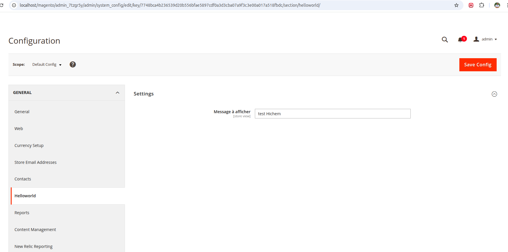
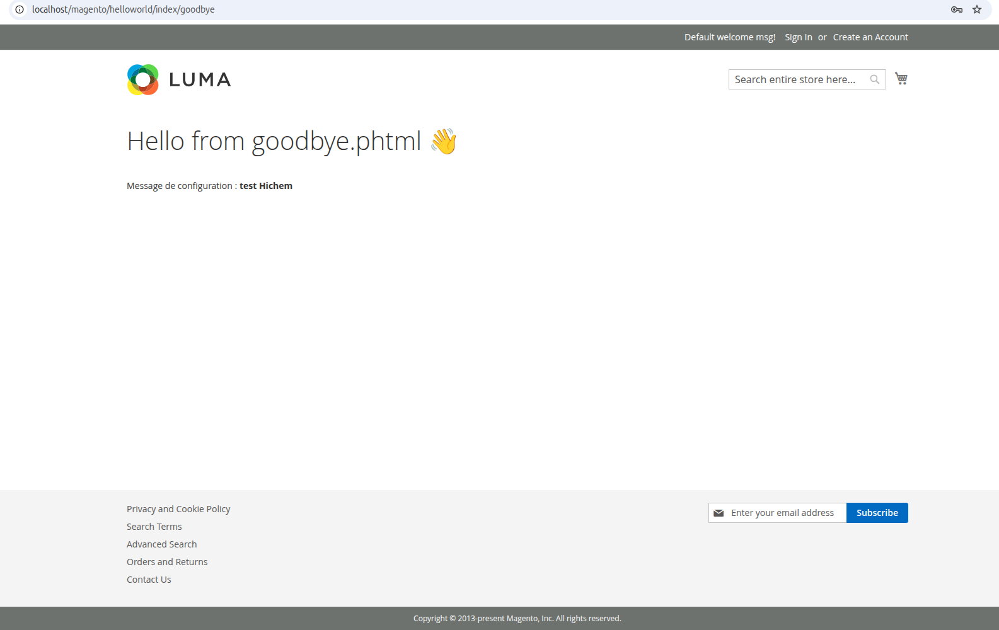

# Module Magento 2 : Hichem_HelloWorld

Ce dépôt contient un module de démonstration Magento 2, développé dans un objectif pédagogique, pour découvrir et pratiquer les concepts fondamentaux de développement sur Magento 2.

## 📦 Objectif du module

Le module `Hichem_HelloWorld` affiche un message personnalisé depuis un template frontend (`goodbye.phtml`) à partir d'une configuration saisie via l'interface d'administration Magento.

---

## 🔨 Travaux réalisés (plan de travail)

### ✅ Jour 1 : Création du module HelloWorld

- Création du squelette du module.
- Déclaration dans `module.xml` et `registration.php`.
- Activation via `bin/magento setup:upgrade`.
- Ajout d’un contrôleur `Index/Index` et d’un template `hello.phtml`.

### ✅ Jour 2 : Ajout d’une nouvelle route Goodbye avec ViewModel

- Ajout du contrôleur `Index/Goodbye`.
- Utilisation d’un ViewModel `ViewModel\Goodbye.php` implémentant `ArgumentInterface`.
- Création du layout `helloworld_index_goodbye.xml` et du template `goodbye.phtml`.
- Affichage d’un message statique : `Hello from goodbye.phtml 👋`.

### ✅ Jour 3 : Configuration via le back-office

- Ajout du fichier `system.xml` pour créer une section personnalisée dans le menu "Configuration > General > Helloworld".
- Ajout du champ `message` dans la configuration.
- Injection de `ScopeConfigInterface` dans le ViewModel pour récupérer la valeur configurée.
- Affichage dynamique dans `goodbye.phtml`.

**📷 Capture de la configuration admin dans Magento :**



**📷 Capture de la page frontend affichant la config :**



---

## ⚙️ Commandes utilisées

```bash
php bin/magento setup:upgrade
php bin/magento setup:di:compile
php bin/magento cache:flush
php bin/magento setup:static-content:deploy -f
